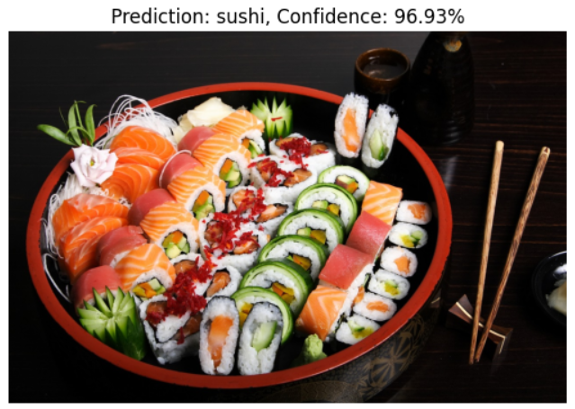

# Self-Project Computer Vision

Here is a collection of self-projects in Computer Vision using PyTorch to continue my learning from the Computer Vision Bootcamp at the Indonesia AI and to enhance problem-solving skills in various Computer Vision applications.

## 1. Gender Classification

This project utilizes the CelebA dataset consisting of 5000 photos containing a mix of males and females. The goal of this project is to experiment with building gender classification models using several pre-trained models. The models used include Inception V3, ResNet 50, and EfficientNet B2. This project contains Exploratory Data Analysis (EDA), Data Preparation, Data Preprocessing, Model Building, Training, Evaluation, and Predictions.

> The Results:

  
  

## 2. Food Classification

* This is a computer vision project to create food classification. The dataset used is Food 101. Only a portion of the dataset is taken, namely pizza, steak, and sushi. This project uses the pre-trained ResNet 50 model.
* In addition to creating a classification model, this project also aims to compare two types of transfer learning methods, namely fine-tuning and fix-feature extractors. Fine-tuning involves retraining all parameters of the pre-trained model on a different dataset to adjust its weights. Fix-feature extractor only trains the modified fully connected layer, while other parameters are not trained again.
* Based on existing theories, the fine-tuning method may cause overfitting because all parameters are retrained. This also results in longer training processes. To address this overfitting, it may be necessary to modify some layers, including the fully connected layer. The fix-feature extractor method is considered more practical, simple, and easy to use because only the fully connected layer is modified and trained, thus avoiding overfitting.
* The results of this comparison have been demonstrated in this experimental documentation.

> The Results:

  
  
  

## 3. Plant Diseases Classification

This is a Computer Vision project that aims to create a classification model for healthy plants and diseased plants. The dataset used is a dataset that is already available on [Kaggle](https://www.kaggle.com/datasets/vipoooool/new-plant-diseases-dataset). The dataset has 38 different classes and has been split into 80/20 portions for training and validation, and a testing directory has been prepared for model predictions. The method used in creating image classification models is Transfer Learning from the ResNet50 and EfficientNet V2 models. Transfer Learning is the most effective and efficient method because many pre-trained models have been tested and can be used for other image classification tasks. Many papers suggest using the Transfer Learning method. The selected pre-trained model has good performance and the number of parameters is not too large so it does not burden the computing process. The performance of the pre-trained model can be seen in the [PyTorch documentation](https://pytorch.org/vision/stable/models.html). The main goal of this project is to conduct experiments and compare the two pre-trained models to get the best classification model.

> The Results:

  
  
  

## 4. Semantic Segmentation

Here is the result of learning AI Computer Vision model creation for the Semantic Segmentation task. The dataset used is the Tray Food dataset. The steps taken include dataset preparation, preprocessing and augmentation, dataloader creation, pretrained model preparation, loss function, optimizer, performance metrics, training process, and prediction. The Semantic Segmentation model used is [UNet](https://github.com/qubvel/segmentation_models.pytorch) with ResNet 50 as the backbone or encoder. The training was done with 10 epochs. The training results include Dice Loss - 0.1327, IoU score - 0.8378, and F1 score - 0.9117. This shows that the Semantic Segmentation model has good performance. Semantic Segmentation can be used in various applications such as self-driving cars, medical diagnosis, and material inspection.

> The Results:

  
  
  

